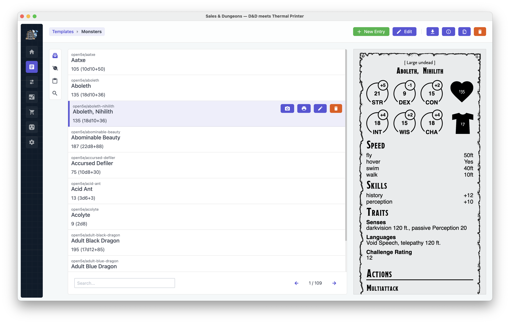
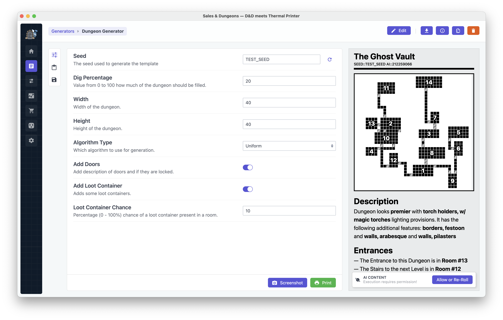

----

  

**Sales & Dungeons** — Thermal Printer as D&amp;D Utility.

With Sales & Dungeons you can create highly customizable handouts, quick reference and much more for your Dungeons and Dragons (or other PnP) Sessions.
Most Thermal Printer are small in size and can be taken with you and kept right at the gaming table. Use-cases range from printing out magic items, spells
or a letter that the group found to little character sheets of your players to use as DM note. The possibilities are nearly endless!

[Printer Setup](https://github.com/BigJk/snd/wiki/Printer-Setup) • [Tested Printer](https://github.com/BigJk/snd/wiki/Printer-Settings) • [Wiki](https://github.com/BigJk/snd/wiki)

**Important:** If you have trouble getting this to work it's best to drop by our [Discord](https://discord.gg/5MUZEjc).

## Features

- Works on
  - Windows
  - Mac (Intel, M1)
  - Linux (x64, ARM64)
  - Raspberry Pi (ARMv6, ARMv7)
  - Anything else go can be compiled on
- Extensive templating system through [Nunjucks](https://mozilla.github.io/nunjucks/)
- Extensive random generator system
- Various connection methods
  - Windows Direct Printing
  - Raw USB Printing
  - CUPS (Linux, Mac)
  - Serial
- Import & Export templates and data sources
- Fast access to external [data sources](https://github.com/BigJk/snd/wiki/Data-Sources) like Open5e (instant access to SRD monsters, spells and more)
- Import data from other sources:
   - CSV
   - [FoundryVTT](https://foundryvtt.com/) Modules
   - Fight Club 5e XML Format
- Access Community Templates, Generators & Data Sources from within the App
- Edit templates in your favorite editor (e.g. Visual Studio Code) and get live preview

## Download 📁

You can find the latest version on the release page:
- https://github.com/BigJk/snd/releases
- **Linux / Mac**: You might need to ``chmod +x`` the executable before you can run it!

## Printer Requirements

At the moment Sales & Dungeons only supports the [ESC/POS](https://en.wikipedia.org/wiki/ESC/P) (Epson Standard Code) control codes, which is still one of the most used control code set. Check if a thermal printer you are interested in mentions ESC/POS or Epson in the description or manual.

In general the rule of thumb is:
- Most cheap chinese thermal printer found on Amazon or AliExpress support it
- Most epson thermal printer obviously support it
- A lot of older Serial printer (like Metapace T-1) also support it

More specific information about tested printers can be found in the wiki: [Printer-Settings](https://github.com/BigJk/snd/wiki/Printer-Settings)

## How It Works

**Templates:** Templates are created in HTML (and CSS) in combination with the Nunjucks templating language. You can imagine
the templates as little websites. That makes it possible to use all the nice and convenient layout options that HTML and CSS
has to offer and even include any common framework you might need (e.g. Fontawesome for Icons).

**Rendered HTML:** After creating a template you can create entries with the data you want and print them.
Nunjucks will create the rendered HTML from the data you want to print.

**Rendered Image:** Then this HTML get's converted to a image. Currently this conversion is done by Chrome via the
Chrome Debug Protocol. Although Chrome seems like a huge overkill for just HTML-To-Image conversion it's the standard solution at the
moment because it supports most of the modern HTML and CSS features.

**ESC / POS Commands:** The last step before our awesome template hits the Printer is the conversion from the rendered image
to the "draw image" command of the printer.

**Printer:** The generated command will then be sent to the printer and printed. Now your template is ready to be used!

:tada: :tada: :tada:

## Printers, Templating & Building

If you want to see what printers were already tested, which settings they need, how the templates work or how you can build Sales & Dungeons yourself please visit the [**wiki**](https://github.com/BigJk/snd/wiki).

## Thanks to all contributors ❤

## Credits

Icons used in the Sales & Dungeons Logo were made by [Smashicons](https://www.flaticon.com/authors/smashicons), [Good Ware](https://www.flaticon.com/authors/good-ware) from [www.flaticon.com](http://www.flaticon.com)
