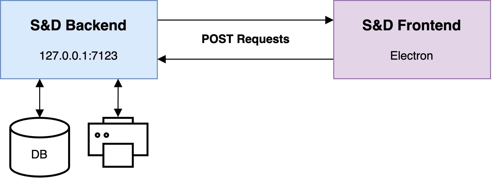

# SDK

Although Sales & Dungeons runs as a local application it is split into a backend (handling the database, printing and more) and the UI (handling the visual interface). Backend and frontend communicate via HTTP requests like typical web applications. This has the nice side effect that other applications can also interact with the S&D. Some examples of what you could do:

- Remotely create, delete, edit templates, generators and data sources
- Write a script that imports data sources from different sources than provided in S&D
- Connect your application to the data from S&D
- Trigger printing
- Create your own UI

## Architecture

## Protocol

Communication is done via HTTP POST requests only, because I'm using my own mini-rpc framework which makes it very simple to make go functions available to a frontend. It's called `nra`, and you can find more about it [here](https://github.com/BigJk/nra). In essence:

- All requests are POST
- The body of the request is a JSON encoded array of arguments (e.g. `["arg1", "arg2", 3, { "hello": "world" }]`)
- All functions are present under ``http://127.0.0.1:7123/api/FUNCTION_NAME``
- You can get a basic overview about the available functions via ``http://127.0.0.1:7123/api/functions``